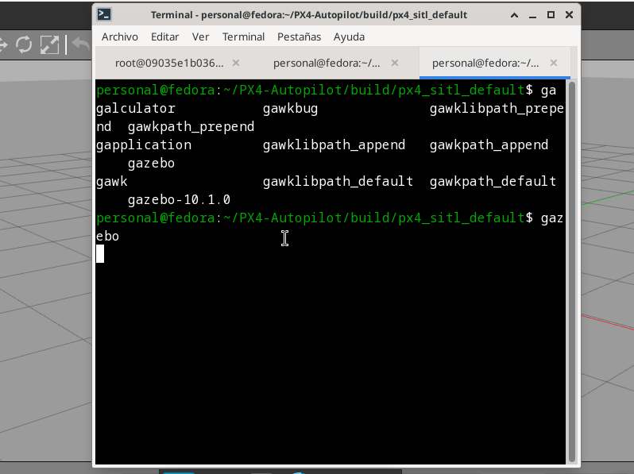

# Instalación del entorno PX4 + Gazebo en Fedora 39 (XFCE)

## Objetivo

Configurar desde cero un entorno funcional para simular drones con **PX4 Autopilot** y
 **Gazebo** en **Fedora 39 XFCE**, documentando cada paso validado para asegurar su correcta ejecución.

---

## 📦 Paso 1: Instalar dependencias

Instalar todas las librerías necesarias del sistema y de Python para compilar y ejecutar el entorno.

```bash
sudo dnf install git cmake ninja-build gcc-c++ python3-pip \
    python3-jinja2 python3-empy python3-toml python3-numpy \
    python3-yaml python3-pyserial python3-pandas \
    python3-pygments python3-setuptools python3-opencv \
    python3-matplotlib python3-scipy \
    gazebo gazebo-devel
```

---

## 📦 Paso 2: Instalar librerías Python específicas

Algunas versiones específicas de librerías Python son necesarias para evitar errores de compatibilidad.

```bash
pip install numpy==1.26.4
pip install pyulog
```

---

## 📦 Paso 3: Clonar y compilar PX4 Autopilot

Clonar el repositorio oficial.

```bash
git clone https://github.com/PX4/PX4-Autopilot.git --recursive
cd ~/PX4-Autopilot
```

---


## Ejecución del entorno (en tres terminales)


### 🖥 Terminal 1: Ingresar al contenedor Docker oficial de desarrollo PX4

Esto aísla el entorno de compilación y asegura compatibilidad.

```bash
docker run -it \
  -v $(pwd):/src/PX4-Autopilot:z \
  -w /src/PX4-Autopilot \
  px4io/px4-dev:v1.16.0-rc1-258-g0369abd556 \
  /bin/bash

make px4_sitl_default
```

### 🖥 Terminal 2: Preparar y lanzar PX4

```bash
cd ~/PX4-Autopilot/build/px4_sitl_default
sudo chown -R personal:personal ~/PX4-Autopilot/build/px4_sitl_default
mkdir -p ~/PX4-Autopilot/build/px4_sitl_default/log
bin/px4 -s etc/init.d-posix/rcS
```

### 🖥 Terminal 3: Lanzar el simulador Gazebo

```bash
gazebo ~/PX4-Autopilot/Tools/sitl_gazebo/worlds/iris.world
```

---

## Para ejecuciones posteriores

### 🖥 Terminal 1: Ingresar al contenedor Docker y compilar

```bash
cd ~/PX4-Autopilot

docker run -it \
  -v $(pwd):/src/PX4-Autopilot:z \
  -w /src/PX4-Autopilot \
  px4io/px4-dev:v1.16.0-rc1-258-g0369abd556 \
  /bin/bash

make px4_sitl_default
```

### 🖥 Terminal 2: Lanzar PX4

```bash
cd ~/PX4-Autopilot/build/px4_sitl_default
bin/px4 -s etc/init.d-posix/rcS
```

### 🖥 Terminal 3: Lanzar Gazebo

```bash
gazebo ~/PX4-Autopilot/Tools/sitl_gazebo/worlds/iris.world
```

---

## ✅ Resultado

Una vez finalizados los pasos anteriores, el entorno estará corriendo correctamente y listo para simular vuelos con 
el dron **Iris** en **Gazebo**, controlado mediante el firmware PX4 en modo **SITL** (Software In The Loop).

---

## 📝 Notas adicionales

- Se recomienda utilizar tres terminales separadas para mantener separados los procesos de **Docker**, **PX4** y **Gazebo**.
- El contenedor `px4io/px4-dev` permite mantener aisladas las dependencias y simplifica el proceso de construcción.
- Asegúrarse de tener los permisos adecuados sobre la carpeta `~/PX4-Autopilot`, especialmente después de ejecutar desde Docker.


---

|     Docker compilando      |     PX4 en ejecución      |      Gazebo cargado       |
|----------------------------|---------------------------|---------------------------|
|  | | |

