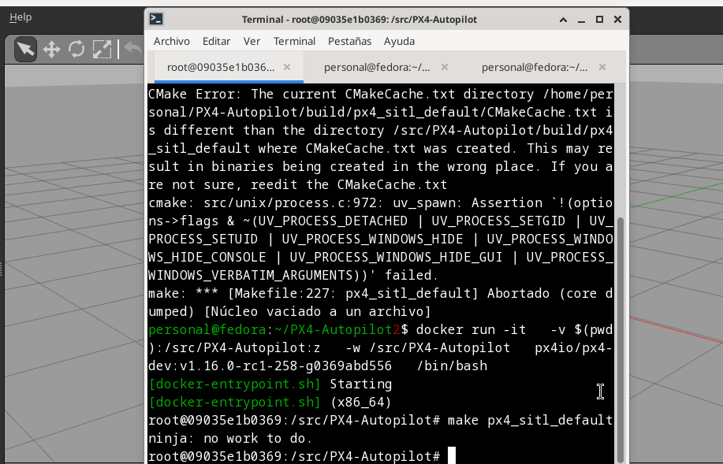
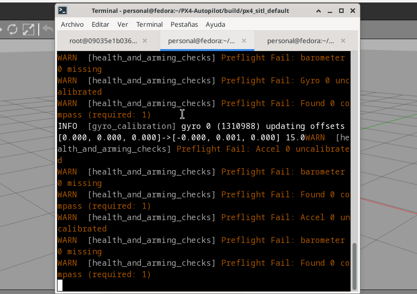

# Instalación del entorno PX4 + Gazebo en Fedora 39 (XFCE)

## Objetivo

Configurar desde cero un entorno funcional para simular drones con **PX4 Autopilot** y
 **Gazebo** en **Fedora 39 XFCE**, documentando cada paso validado para asegurar su correcta ejecución.

---

## 📦 Paso 1: Instalar dependencias

Instalar todas las librerías necesarias del sistema y de Python para compilar y ejecutar el entorno.

```bash
sudo dnf install git cmake ninja-build gcc-c++ \
	python3-pip python3-jinja2 python3-empy python3-toml \
	python3-numpy python3-yaml python3-pyserial python3-pandas \
	python3-pygments python3-setuptools python3-opencv  \
	python3-matplotlib python3-scipy  \
	gazebo gazebo-devel opencv opencv-devel \
	glib2-devel gstreamer1-devel gstreamer1-plugins-base-devel  \
	gstreamer1-plugins-good gstreamer1-plugins-bad-free  \
	eigen3-devel
```

---

## 📦 Paso 2: Instalar librerías Python específicas

Algunas versiones específicas de librerías Python son necesarias para evitar errores de compatibilidad.

```bash
pip3 install --user numpy==1.26.4 pyulog pyros-genmsg jsonschema
pip3 install kconfiglib
```

---

## 📦 Paso 3: Clonar y compilar PX4 Autopilot

Clonar el repositorio oficial.

```bash
git clone https://github.com/PX4/PX4-Autopilot.git --recursive
cd ~/PX4-Autopilot
git submodule update --init --recursive
```

---

## 📦 Paso 4: Compilar PX4 + Gazebo Classic

Degradar CMake por compatibilidad, limpiar compilaciones anteriores y 
compilar con soporte para Gazebo Classic.

```bash
cd ~/PX4-Autopilot
sudo dnf downgrade cmake
make clean
make px4_sitl gazebo-classic
```

---

## 📦 Paso 5: Configurar entorno

Configurar variables de entorno para que Gazebo encuentre los modelos necesarios.

```bash
nano ~/.bashrc
export GAZEBO_MODEL_PATH=$HOME/PX4-Autopilot/Tools/simulation/gazebo-classic/sitl_gazebo-classic/models
source ~/.bashrc
reboot
```

---


## Ejecución del entorno (en 2 terminales)


### 🖥 Terminal 1: Preparar y lanzar PX4

```bash
cd ~/PX4-Autopilot
source Tools/simulation/gazebo-classic/setup_gazebo.bash $(pwd) $(pwd)/build/px4_sitl_default
cd ~/PX4-Autopilot/build/px4_sitl_default
bin/px4 -s etc/init.d-posix/rcS
```

---

### 🖥 Terminal 2: Lanzar el simulador Gazebo

```bash
cd ~/PX4-Autopilot
gazebo Tools/sitl_gazebo/worlds/iris.world
```

---

## ✅ Resultado

Entorno limpio y funcional con el dron Iris en Gazebo Classic, controlado por PX4 SITL, 
sin elementos adicionales ni dependencias innecesarias, y sin usar Docker. 
Esta configuración sirve como base estable para futuros ejercicios y desarrollos.


---

|Compilación previa en Docker|     PX4 en ejecución      |      Gazebo cargado       |
|----------------------------|---------------------------|---------------------------|
|  | | |

