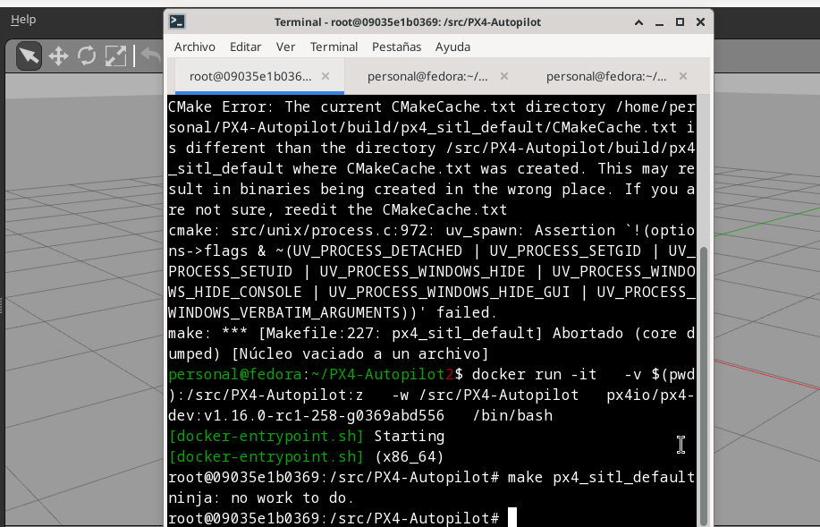
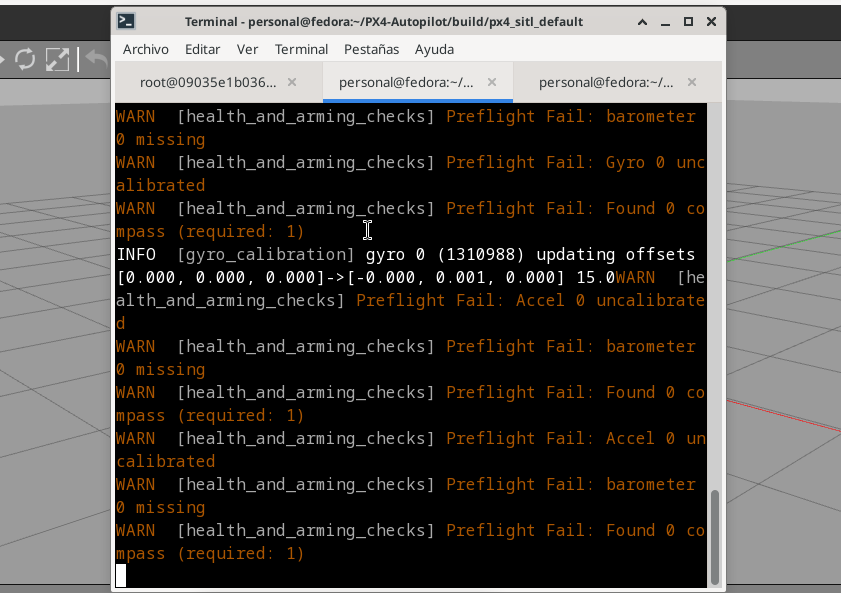

# Installing PX4 + Gazebo Environment on Fedora 39 (XFCE)

## Goal

Set up a functional environment from scratch to simulate drones using **PX4 Autopilot** and 
**Gazebo** on **Fedora 39 XFCE**, documenting each validated step to ensure correct execution.

---

## 📦 Step 1: Install Dependencies

Install all required system and Python libraries needed to compile and run the environment.

```bash
sudo dnf install git cmake ninja-build gcc-c++ \
	python3-pip python3-jinja2 python3-empy python3-toml \
	python3-numpy python3-yaml python3-pyserial python3-pandas \
	python3-pygments python3-setuptools python3-opencv  \
	python3-matplotlib python3-scipy  \
	gazebo gazebo-devel opencv opencv-devel \
	glib2-devel gstreamer1-devel gstreamer1-plugins-base-devel  \
	gstreamer1-plugins-good gstreamer1-plugins-bad-free  \
	eigen3-devel
```

---

## 📦 Step 2: Install Specific Python Libraries

Specific versions of Python libraries are needed to avoid compatibility issues.

```bash
pip3 install --user numpy==1.26.4 pyulog pyros-genmsg jsonschema
pip3 install kconfiglib
```

---

## 📦 Step 3: Clone and Build PX4 Autopilot

Clone the official repository.

```bash
git clone https://github.com/PX4/PX4-Autopilot.git --recursive
cd ~/PX4-Autopilot
git submodule update --init --recursive
```

---

## 📦 Step 4: Build PX4 + Gazebo Classic

To downgrade CMake for compatibility, to clean previous builds, 
and to compile with Gazebo Classic support.

```bash
cd ~/PX4-Autopilot
sudo dnf downgrade cmake
make clean
make px4_sitl gazebo-classic
```

---

## 📦 Step 5: Set Up Environment

To configure environment variables so that Gazebo can find the required models.

```bash
nano ~/.bashrc
export GAZEBO_MODEL_PATH=$HOME/PX4-Autopilot/Tools/simulation/gazebo-classic/sitl_gazebo-classic/models
source ~/.bashrc
reboot
```

---


## Run the Environment (2 Terminals)


### 🖥 Terminal 1: Prepare and launch PX4

```bash
cd ~/PX4-Autopilot
source Tools/simulation/gazebo-classic/setup_gazebo.bash $(pwd) $(pwd)/build/px4_sitl_default
cd ~/PX4-Autopilot/build/px4_sitl_default
bin/px4 -s etc/init.d-posix/rcS
```

---

### 🖥 Terminal 2: Launch the Gazebo simulator

```bash
cd ~/PX4-Autopilot
gazebo Tools/sitl_gazebo/worlds/iris.world
```

---

## ✅ Expected Result

A clean, functional environment running the Iris drone in Gazebo Classic, controlled by PX4 SITL, 
without extra components or unnecessary dependencies, and without using Docker. 
This setup provides a stable foundation for upcoming exercises and development.


---
 
|  Initial build in Docker   |       Launch PX4          |       Launch Gazebo       |
|----------------------------|---------------------------|---------------------------|
|  | | |

